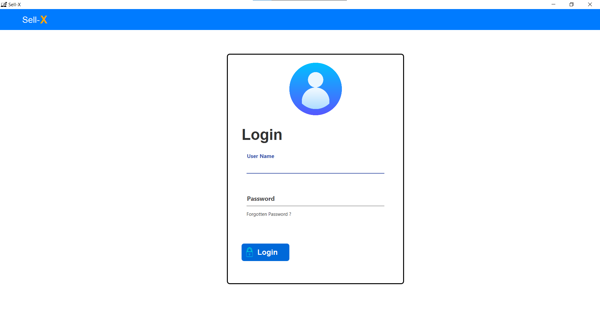
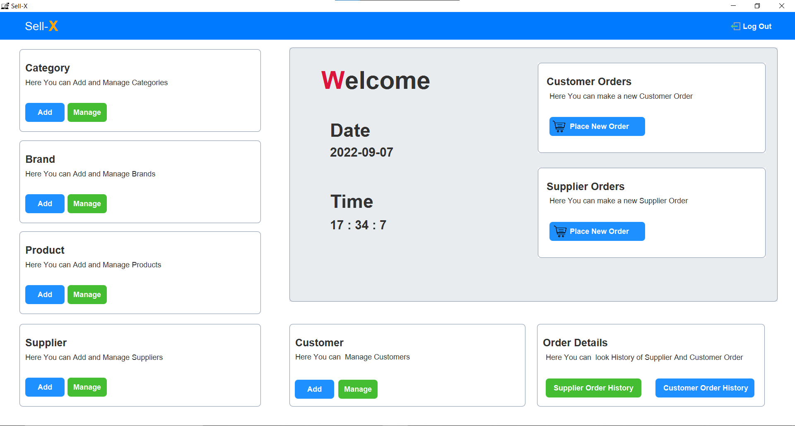
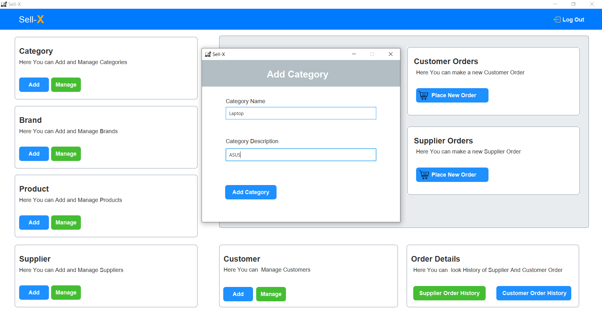
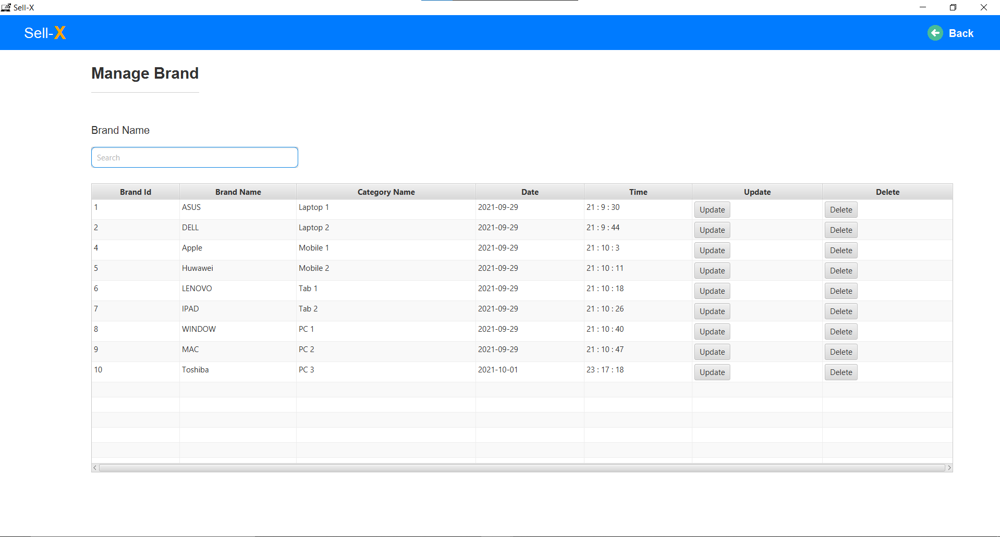
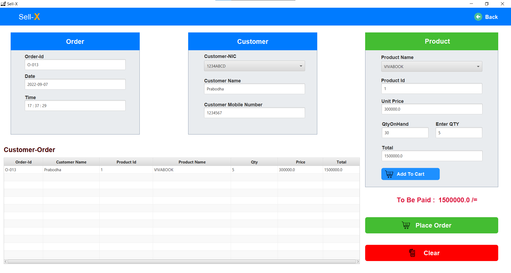

#Inventory Management System 

This project is done by using MVC Architecture and MySQL database

*MVC Architecture 
*Java 
*javaFx 
*MySQL

<b>#Login </b>
 
<b>#DashBoard <b>
 
<b>#Add <b>
 
<b>#Manage <b>
 
<b>#PlaceOrder </b>

